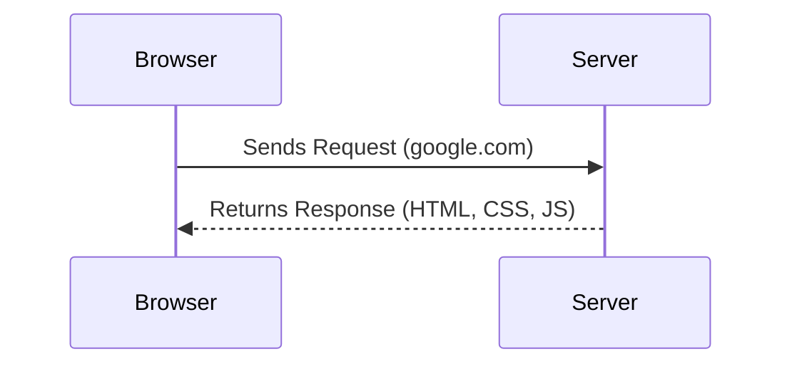
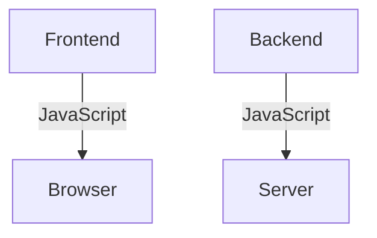

---

# Episode 2: **JavaScript on the Server** 🌐✨  

> Think of a server as a computer located remotely, waiting to handle your requests!  

---

## 🚀 **What is a Server?**  
A server is essentially a **remote computer** that listens to requests from the browser (or any client) and responds with data or services.  

### Example:  
When you type `google.com` into your browser:  
1. **Browser Request**: Your browser sends a request → `google.com`  
2. **Server Response**: The request is sent to a remote server → `114.265.123.8`  
3. The server processes the request and sends back the website data.  

---

## 🖥️ **Evolution of JavaScript**  

### Before Node.js  
- JavaScript was limited to **frontend development** (running only in the browser).  
- Backend developers relied on languages like **Java, Python, or C++**.  

### After Node.js  
With **Node.js**, JavaScript moved to the **server-side**:  
- Frontend: JavaScript  
- Backend: **JavaScript**  
- Full-Stack Development 🌟 became a reality!  

---

## 🔥 **Why is Node.js Revolutionary?**  

Node.js enabled developers to write **entire applications** using only JavaScript. This gave rise to the **MEAN stack**:  
- **M**: MongoDB  
- **E**: Express.js  
- **A**: Angular (or React)  
- **N**: Node.js  

This stack revolutionized web development, allowing **full-stack JavaScript** applications to thrive.  

---

## 🌈 **The Power of V8 Engine**  

Node.js uses **Google’s V8 JavaScript Engine**:  
- It’s a **C++ program** that converts JavaScript code into **machine code** for faster execution.  
- V8 adheres to **ECMAScript standards**, which ensure uniformity across different JavaScript engines.  

### Popular JavaScript Engines:  
| Engine         | Browser           | Maintained By      |
|----------------|-------------------|--------------------|
| **V8**         | Chrome, Edge      | Google             |
| **SpiderMonkey** | Firefox          | Mozilla            |
| **Chakra**     | Internet Explorer | Microsoft          |

### Diagram: **How V8 Works**  
```
JavaScript Code → V8 Engine → Machine Code → Executed by CPU  
```

---

## 🛠️ **JavaScript Standards (ECMAScript)**  

### What is ECMAScript?  
ECMAScript is a **standardized specification** for JavaScript. It is maintained by a committee that decides:  
1. New features.  
2. Rules for all JavaScript engines to follow.  

### Popular ECMAScript Features:  
- **ES6+**: Modern JavaScript features like `let`, `const`, arrow functions, promises, etc.  

---

## 🌐 **Node.js and Low-Level Programming**  

### What Happens Underneath?  
To understand how JavaScript runs on a server, consider this:  
1. A computer **only understands binary (0s and 1s)**.  
2. Binary is too complex for humans, so we write in **high-level languages (HLL)** like JavaScript.  
3. The V8 engine acts as a translator:  
   - Converts HLL code → **Machine code** → **Binary code**.  

### Diagram: **The Code Translation Journey**  
```
JavaScript Code  
   ↓  
V8 Engine (Interpreter)  
   ↓  
Machine Code  
   ↓  
Binary (0s and 1s)  
```

---

## 🎯 **Why is Node.js So Popular?**  

1. **JavaScript Everywhere**: Write code once, use it everywhere — frontend & backend!  
2. **Fast Execution**: Powered by the blazing-fast **V8 engine**.  
3. **Non-Blocking I/O**: Handles multiple requests simultaneously without blocking.  
4. **Modular Design**: Use frameworks like **Express** to build scalable applications.  

---

## 🎨 **Diagrams and Examples**  

### Browser and Server Interaction:  


---

### JavaScript on Both Sides:  


---

## 📝 **Key Takeaways**  

- Node.js made it possible to write **JavaScript on the server-side**, breaking the barrier between frontend and backend development.  
- The **V8 engine** translates JavaScript code into machine code, enabling high performance.  
- With standards like **ECMAScript**, JavaScript remains consistent across engines and platforms.  

---

## 📚 **Further Reading**  

- [Node.js Official Documentation](https://nodejs.org)  
- [Learn about ECMAScript](https://tc39.es/)  

---

With JavaScript on both the **frontend** and **backend**, your journey to full-stack development just got a whole lot simpler! 🎉  

--- 