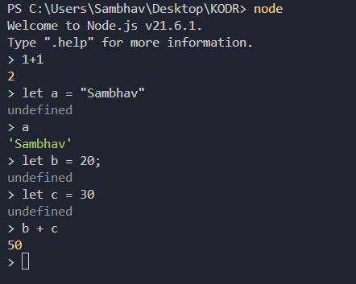
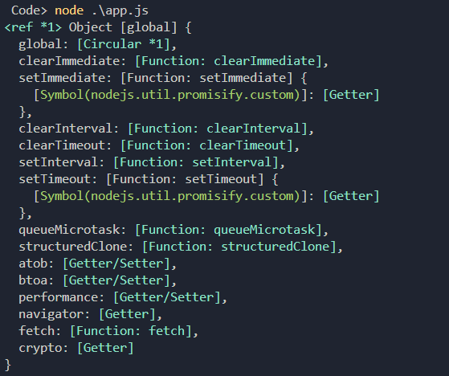

# 🌟 Backend Development Journey  
## Episode 3: Let's Write Code 🎉

This episode dives into writing our first backend code, exploring Node.js, and understanding some essential concepts like the **Global Object**. Here's everything you need to know to get started!

---

## 🚀 Table of Contents

1. [Installing Node.js](#installing-nodejs)  
2. [Writing Code in Node.js](#writing-code-in-nodejs)  
3. [Global Object in Node.js](#global-object-in-nodejs)  

---

## 1️⃣ Installing Node.js

To get started, follow these steps:  
- 🔗 Go to the [Node.js Official Website](https://nodejs.org/) and download the latest version.
- 🛠️ Verify the installation:  
  Open your terminal and run the following commands:
  ```bash
  node -v
  npm -v
  ```
  This will display the versions of Node.js and npm installed on your system.

---

## 2️⃣ Writing Code in Node.js

### **Using Node REPL**  
- Start the **Node REPL** (Read, Evaluate, Print, Loop) by running:
  ```bash
  node
  ```
- You can now write JavaScript code directly in your terminal!  
  <div align="center">
      
  </div>

#### **Behind the Scenes:**  
- Node.js uses the **V8 JavaScript Engine** with additional capabilities (aka **SUPER POWERS** 💪).

---

### **Creating and Running Files**  
Instead of writing all your code in the terminal, you can:  
1. Create a file named `app.js`.  
2. Write some JavaScript code in the file.  
3. Run the file in your terminal using:
   ```bash
   node app.js
   ```
---

## 3️⃣ Global Object in Node.js

### **The Global Object**  
In browsers, the global object is called `window`.  
In Node.js, the global object is named **Global**.  

To see this in action:  
1. Write the following code in `app.js`:
   ```javascript
   console.log(global);
   ```
2. Run the file to see the **Global Object** in the terminal.  
   <div align="center">
       
   </div>

---

### **Key Differences Between Browser and Node.js**  
- **In the Browser:**  
  ```javascript
  console.log(this); // Refers to the `window` object.
  ```
- **In Node.js:**  
  ```javascript
  console.log(this); // Outputs an empty object `{}`.
  ```

#### **Note:**  
The `global` object in Node.js is not part of the V8 engine but comes from its **SUPER POWERS**.
Also OPEN JS Community created a globalThis as a standard that will always point to global object in every technologies of JS.

---

## 📝 Summary  

- Node.js gives us access to powerful global objects and tools.  
- We can write code directly in the terminal or organize it better using files and folders.  
- The global object differs between browsers and Node.js, highlighting their unique environments.

---

Feel free to explore further by playing with `global` and creating your own scripts! 🚀