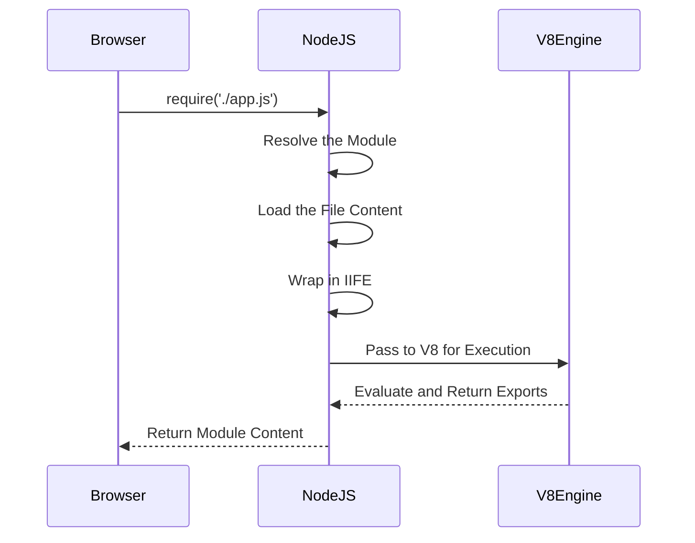

# Episode 5: **Diving into Node.js Repository** 🛠️🚀  

> Let’s uncover the magic behind `require` and how Node.js handles modules under the hood!  

---

## 🌟 **How Does the `require()` Function Work?**  

When you write:  
```javascript
const app = require('./app.js');
```
This simple-looking line hides a **complex yet fascinating mechanism**! Here's the magic:  

### 🪄 **Wrapping Code Inside a Function**  
- Every module in Node.js is **wrapped inside a function**.  
- This is why variables and functions declared inside a module are **private** and cannot be accessed directly outside of it.  

### ✨ **Behind the Scenes**  
When you call `require('./app.js')`:  
1. Node wraps all the code in `app.js` like this:  
    ```javascript
    (function (module, exports, require, __dirname, __filename) {
        // Your app.js code goes here!
    });
    ```  
2. This function is an **IIFE (Immediately Invoked Function Expression)**, which is called **immediately** to execute the module.  

---

## 🔍 **What is an IIFE?**  
**IIFE** stands for **Immediately Invoked Function Expression**.  
It’s a function that:  
- **Executes immediately** after it is defined.  
- Keeps variables and functions **private** (encapsulation).  

### Example of an IIFE:  
```javascript
(function () {
    console.log("This is an IIFE Function!");
})();
```  

### 🛡️ Why Do We Need IIFEs?  
- To **protect variables** and **prevent conflicts** between different modules.  
- Ensures that each module has its **own private scope**.  

---

## 🔐 **How Are Variables and Functions Private in Modules?**  

It's because of:  
1. **IIFE**  
2. **`require()` Function**  

When `require()` is called:  
- It wraps the code inside an **IIFE**.  
- This ensures that variables and functions declared in one module are not accessible in others.  

---

## 🗂️ **Accessing `module.exports`**  

To share variables or functions across modules:  
- Node.js passes `module` and `exports` as arguments to the IIFE.  
- Example:  
    ```javascript
    (function (module, exports, require) {
        module.exports = {
            name: "Node.js",
            version: "1.0.0"
        };
    })(module, module.exports, require);
    ```

---

## ⚙️ **The 5-Step Mechanism of `require()`**  

Whenever you call the `require()` function, Node.js performs these 5 steps:

### 1️⃣ **Resolving a Module**  
Node checks whether the module:  
- Is a **local file/module** (e.g., `./app.js`).  
- Is a **JSON file**.  
- Is an **internal module** (e.g., `fs`, `path`).  

### 2️⃣ **Loading the Module**  
The content of the file is **loaded** based on its type:  
- `.js` files are treated as JavaScript.  
- `.json` files are parsed into JSON objects.  
- Compiled `.node` files are loaded as binary.  

### 3️⃣ **Compiling the Module**  
- Node wraps the code in an **IIFE**:  
    ```javascript
    (function (exports, require, module, __filename, __dirname) {
        // Code inside your module
    });
    ```

### 4️⃣ **Code Evaluation**  
- The wrapped function is **executed**, providing access to `require`, `module.exports`, and other local variables.  

### 5️⃣ **Caching the Module**  
- If the same module is required again, Node.js uses the **cached version** instead of reloading it.  
- This ensures faster execution and **optimized performance**.  

---

## 🖼️ **Visualizing the Process**  

### 📂 **Module Resolution**  
```mermaid
graph TD;
    A[require('./app.js')] --> B[Is it a Local File?];
    B -->|Yes| C[Resolve Path];
    B -->|No| D[Is it a Node.js Internal Module?];
    D -->|Yes| E[Load Internal Module];
    D -->|No| F[Error: Module Not Found];
```

### 🔄 **The 5-Step Process**  


---

## 🧠 **Key Takeaways**  

- The `require()` function wraps code in an **IIFE** to ensure private scopes.  
- Variables and functions in one module cannot affect others unless explicitly exported via `module.exports`.  
- Node.js **caches modules** for optimized performance.  
- **5 Steps of `require()`**: Resolve → Load → Compile → Evaluate → Cache.  

---

## 🎓 **Further Learning**  

- [Node.js Documentation](https://nodejs.org)  
- [Understanding Module System in Node.js](https://nodejs.dev)  

---

✨ **Dive deeper into the Node.js ecosystem and explore how its efficient module system powers modern JavaScript development!**  

---  