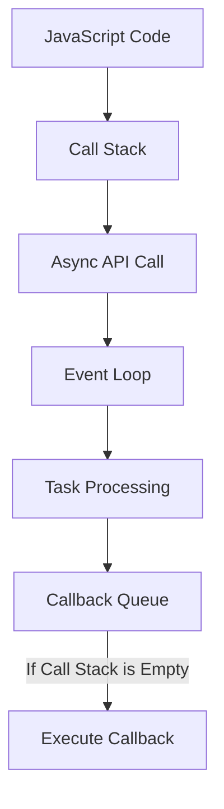

# 📖 Episode 6: Understanding Node.js Event-Driven Architecture & Libuv 🚀  

> **"JavaScript is synchronous by nature, but Node.js enables asynchronous execution with event-driven architecture."**  

---

## 🌍 **Node.js: Event-Driven & Asynchronous**  

Node.js is **event-driven** and supports **asynchronous I/O operations**, making it efficient for handling multiple tasks without blocking the main execution thread.  

But before diving deeper, let’s understand the difference between **synchronous** and **asynchronous** execution.  

---

## 🔄 **Synchronous vs Asynchronous Execution**  

JavaScript is a **single-threaded** language, which means it can execute **one task at a time**. By default, it follows a **synchronous execution model**, but Node.js introduces **asynchronous capabilities** to improve efficiency.  

### 🍽️ **Example: A Restaurant Analogy**  

#### **🕰️ Synchronous Execution** (Blocking)  
In a **synchronous system**, tasks are executed **one after another**, even if a task takes **zero time**.  

🔹 Imagine a restaurant with **three food items**:  
- **Coke** 🥤 → **0 minutes**  
- **Pizza** 🍕 → **10 minutes**  
- **Noodles** 🍜 → **5 minutes**  

Now, five people place their orders:  
1️⃣ Person 1 → **Noodles** (5 min)  
2️⃣ Person 2 → **Pizza** (10 min)  
3️⃣ Person 3 → **Coke** (0 min)  
4️⃣ Person 4 → **Noodles** (5 min)  
5️⃣ Person 5 → **Pizza** (10 min)  

**Order Execution:**  
✔️ **Person 1 gets served in** **5 min**  
✔️ **Person 2 gets served in** **15 min** (5 + 10)  
✔️ **Person 3 gets served in** **15 min** (*even though Coke takes 0 min!*)  
✔️ **Person 4 gets served in** **20 min**  
✔️ **Person 5 gets served in** **30 min**  

🛑 **Issue:**  
- **Person 3 (Coke) had to wait 15 minutes unnecessarily!**  
- Even fast tasks are delayed due to blocking execution.  

---

#### **⚡ Asynchronous Execution** (Non-blocking)  

🔹 Now, the restaurant **processes orders simultaneously**.  

**Order Execution:**  
✔️ **Person 1 (Noodles) gets served in** **5 min**  
✔️ **Person 2 (Pizza) gets served in** **10 min**  
✔️ **Person 3 (Coke) gets served in** **0 min** ✅  
✔️ **Person 4 (Noodles) gets served in** **5 min**  
✔️ **Person 5 (Pizza) gets served in** **10 min**  

✅ **Advantage:**  
- **Person 3 didn’t have to wait!** 🚀  
- Tasks are **executed as soon as they are ready**, instead of waiting in line.  

---

## 🏗️ **How Does Node.js Achieve Asynchronous Execution?**  

Node.js is **not** asynchronous by default. Instead, it relies on **Libuv**, an external C++ library, to handle asynchronous tasks efficiently.  

---

## 🛠️ **Role of Libuv in Node.js**  

🔹 **Libuv is a cross-platform C library** that provides:  
✔️ **Event Loop Mechanism**  
✔️ **Thread Pool for Non-blocking Operations**  
✔️ **Asynchronous I/O Support**  

**Key Features:**  
1️⃣ Handles **I/O operations** asynchronously (File system, Network, TCP, UDP).  
2️⃣ Provides a **Thread Pool** for CPU-intensive tasks.  
3️⃣ Manages **Timers (setTimeout, setInterval)** efficiently.  
4️⃣ Supports **Child Processes & Signals**.  

---

## 🔄 **How Libuv Works?**  

📌 **The Node.js Execution Flow**  

```mermaid
graph TD;
    A[JavaScript Code] --> B[Call Stack];
    B --> C[Node.js API Call] --> D[Libuv Library];
    D --> E[Event Loop] --> F[Thread Pool (if needed)];
    F -->|Completed Task| G[Callback Queue];
    G -->|Processed in Event Loop| H[JavaScript Code Resumes];
```

---

### 🔥 **How Libuv Handles Asynchronous Tasks?**  

1️⃣ **JavaScript Calls an Asynchronous Function**  
   - Example: `fs.readFile()`, `setTimeout()`, or `http.get()`.  

2️⃣ **Node.js Sends the Task to Libuv**  
   - Libuv determines if the task is **I/O-bound** or **CPU-bound**.  
   - If **I/O-bound**, it uses an **event loop**.  
   - If **CPU-bound**, it delegates to the **thread pool**.  

3️⃣ **Libuv Manages the Execution**  
   - **Event Loop**: Handles quick tasks.  
   - **Thread Pool**: Executes CPU-heavy tasks in parallel.  

4️⃣ **Task Completion & Callback Execution**  
   - Once the task is completed, the **callback function** is placed in the **callback queue**.  
   - The **event loop** checks if the call stack is empty and executes the callback.  

---

## 🔄 **Understanding the Node.js Event Loop**  

📌 The **Event Loop** is the heart of Node.js, enabling non-blocking execution.  



### 🛠️ **Node.js Event Loop Phases**  

1️⃣ **Timers Phase**  
   - Executes `setTimeout()` & `setInterval()` callbacks.  

2️⃣ **Pending Callbacks Phase**  
   - Handles I/O-related callbacks.  

3️⃣ **Idle & Prepare Phase**  
   - Internal operations.  

4️⃣ **Poll Phase**  
   - Retrieves new I/O events and executes them.  

5️⃣ **Check Phase**  
   - Executes `setImmediate()` callbacks.  

6️⃣ **Close Callbacks Phase**  
   - Handles cleanup operations.  

---

## 🚀 **Key Takeaways**  

✅ **JavaScript is synchronous** but **Node.js supports asynchronous execution**.  
✅ **Synchronous execution is blocking**, while **asynchronous execution allows parallel task processing**.  
✅ **Libuv enables Node.js to handle I/O operations asynchronously** via an **event loop and thread pool**.  
✅ **The event loop ensures non-blocking execution**, improving performance and scalability.  

---

## 📚 **Further Learning**  

📌 **Libuv Documentation**: [https://libuv.org/](https://libuv.org/)  
📌 **Understanding the Event Loop**: [https://nodejs.dev/learn](https://nodejs.dev/learn)  

---

🔥 **Now you understand how Node.js achieves asynchronous execution using Libuv! Happy Coding! 🚀**